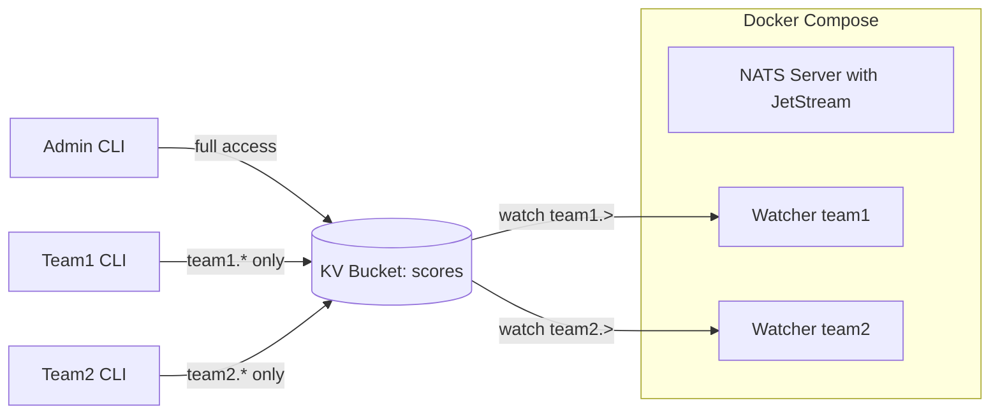

# NATS Score - Multi-Tenant KV Watcher

A Go application that watches a NATS KV bucket for changes with multi-tenant authorization. Each team can only access their own data.

## Architecture



## Authorization Model

| User | Password | Access |
|------|----------|--------|
| `admin` | `adminpass` | Full access to all subjects |
| `team1` | `team1-secret` | Only `scores.team1.>` |
| `team2` | `team2-secret` | Only `scores.team2.>` |
| `team3` | `team3-secret` | Only `scores.team3.>` |

Teams can only read/write to keys prefixed with their team name (e.g., `team1.player1`).

## Prerequisites

- [Docker](https://docs.docker.com/get-docker/) and Docker Compose
- [NATS CLI](https://github.com/nats-io/natscli) (for interacting with the system)

### Installing NATS CLI

**macOS:**
```bash
brew install nats-io/nats-tools/nats
```

**Linux:**
```bash
curl -sf https://binaries.nats.dev/nats-io/natscli/nats@latest | sh
sudo mv nats /usr/local/bin/
```

## Quick Start

### 1. Start the System

```bash
docker-compose up -d
```

This starts:
- NATS server with JetStream and authorization enabled
- Init container to create KV bucket and stream (as admin)
- Team1 watcher application

### 2. Verify Services are Running

```bash
# Check container status
docker-compose ps

# View watcher logs
docker-compose logs -f watcher-team1
```

### 3. Add Data as Admin (Full Access)

```bash
# Admin can write to any key
nats kv put scores team1.player1 '{"score":100}' \
  --user admin --password adminpass

nats kv put scores team2.player1 '{"score":200}' \
  --user admin --password adminpass

# Admin can view all keys
nats kv ls scores --user admin --password adminpass
```

### 4. Test Team-Scoped Access

```bash
# Team1 can write to their own keys
nats kv put scores team1.player2 '{"score":150}' \
  --user team1 --password team1-secret

# Team1 CANNOT write to team2's keys (permission denied)
nats kv put scores team2.hacker '{"score":999}' \
  --user team1 --password team1-secret
# Error: nats: Permissions Violation for Publish

# Team1 can only see their own keys when watching
nats kv watch scores "team1.>" --user team1 --password team1-secret
```

### 5. Watch Team1 Watcher Logs

```bash
# In one terminal, watch the logs
docker-compose logs -f watcher-team1

# In another terminal, add data for team1
nats kv put scores team1.player3 '{"score":175}' \
  --user team1 --password team1-secret
```

The watcher will only show changes for `team1.*` keys.

## Adding New Teams

1. Edit `nats-server.conf` to add a new user:

```conf
# In the authorization block, add:
team4_perms = {
    publish = ["scores.team4.>", "$KV.scores.team4.>", "_INBOX.>"]
    subscribe = ["scores.team4.>", "$KV.scores.team4.>", "_INBOX.>"]
}

# In the users array, add:
{
    user: team4
    password: "team4-secret"
    permissions: $team4_perms
}
```

2. Optionally add a watcher in `docker-compose.yml`:

```yaml
watcher-team4:
  build:
    context: .
    dockerfile: Dockerfile
  environment:
    - NATS_URL=nats://nats:4222
    - NATS_USER=team4
    - NATS_PASSWORD=team4-secret
    - TEAM_NAME=team4
  depends_on:
    nats-setup:
      condition: service_completed_successfully
```

3. Restart the system:

```bash
docker-compose down
docker-compose up -d
```

## Components

### Infrastructure as Code

JetStream resources are defined declaratively in [`nats-setup.sh`](nats-setup.sh) and created by an init container (as admin) before watchers start.

### KV Bucket: `scores`
- Stores score data as JSON
- Keys should be prefixed with team name: `<team>.<key>`
- Maintains history of last 5 revisions per key
- Defined in: `nats-setup.sh`

### Stream: `score-events`
- Receives all KV change events
- Subjects follow pattern: `scores.<team>.<key>`
- Retains messages for 24 hours
- Defined in: `nats-setup.sh`

## Configuration

### Environment Variables

| Variable | Description | Default |
|----------|-------------|---------|
| `NATS_URL` | NATS server URL | `nats://localhost:4222` |
| `NATS_USER` | Username for authentication | (none) |
| `NATS_PASSWORD` | Password for authentication | (none) |
| `TEAM_NAME` | Team identifier for logging and key filtering | `unknown` |

## Monitoring

Access NATS monitoring at http://localhost:8222

Useful endpoints:
- http://localhost:8222/healthz - Health check
- http://localhost:8222/varz - Server variables
- http://localhost:8222/jsz - JetStream info
- http://localhost:8222/connz - Connection info

## Stopping the System

```bash
# Stop and remove containers
docker-compose down

# Stop and remove containers + volumes (clears all data)
docker-compose down -v
```

## Development

### Running Locally (without Docker)

1. Start only NATS:
```bash
docker-compose up -d nats
```

2. Run the setup script to create JetStream resources:
```bash
docker-compose up nats-setup
```

3. Run the Go application as a specific team:
```bash
NATS_URL=nats://localhost:4222 \
NATS_USER=team1 \
NATS_PASSWORD=team1-secret \
TEAM_NAME=team1 \
go run ./cmd/watcher
```

### Building the Go Application

```bash
go build -o watcher ./cmd/watcher
```

## Troubleshooting

### Permission Denied Errors
Ensure you're using the correct credentials and accessing only your team's keys:
```bash
# Check which user you're connecting as
nats server info --user team1 --password team1-secret
```

### Watcher not connecting to NATS
Check if NATS is healthy:
```bash
docker-compose ps
docker-compose logs nats
```

### View watcher logs
```bash
docker-compose logs -f watcher-team1
```

## Security Notes

- Change default passwords in production!
- Store credentials in environment variables or secrets management
- Consider using NKeys or JWT auth for production deployments
- The `_INBOX.>` permission is required for request-reply patterns
